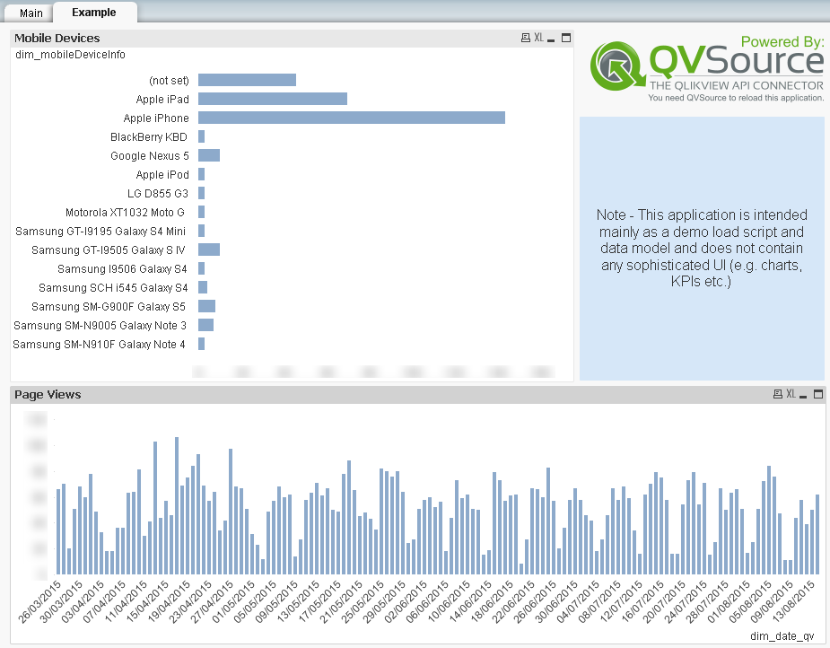

## QVSource Google Analytics Starter App For QlikView (V2)
A template application showing how to get started using the [QVSource Google Analytics Connector for QlikView and Qlik Sense](http://wiki.qvsource.com/Google-Analytics-Connector-For-QlikView-(v3).ashx).

Currently, this application is primarily a load script (no significant UI) intended to load the data from many of these [common queries](https://developers.google.com/analytics/devguides/reporting/core/v3/common-queries) into a single concatenated table in QlikView or Qlik Sense.

*Note that the [load script](https://github.com/QVSource/QVSource-Google-Analytics-Starter-App-For-QlikView-V2/blob/master/QVSource-Google-Analytics-Starter-App-Load-Script-And-Data-Model-V2-prj/LoadScript.txt) should also work in Qlik Sense.*

It should be possible for the developer to add their own queries into this as needed.

If you are a QlikView (or Qlik Sense) + QVSource user you can simply click the ["Download ZIP"](https://github.com/QVSource/QVSource-Google-Analytics-Starter-App-For-QlikView-V2/archive/master.zip) button on GitHub to grab this application.

The content below is copied from the change log in the first tab of the load script.

Change Log
----------
0.1.0 - 22/09/15
----------------
* Removed config.txt as this was not being used.
* Added a couple of very simple charts to a new tab.

0.0.8 - 02/04/14
----------------
* Initial version.